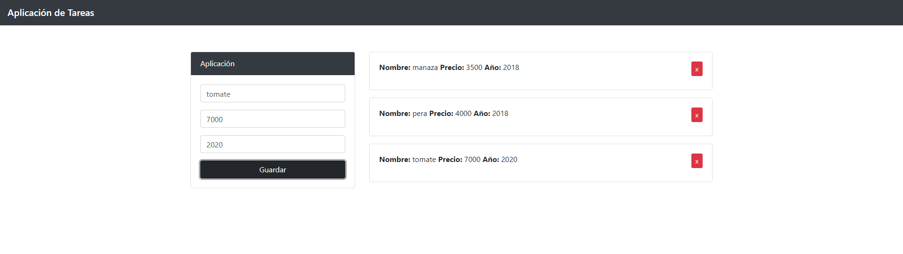

<!DOCTYPE html>
<html lang="en">
    <head>
        <meta charset="UTF-8">
        <meta name="viewport" content="width=device-width, initial-scale=1.0">
        <link rel="stylesheet" href="https://cdn.jsdelivr.net/npm/bootstrap@4.5.3/dist/css/bootstrap.min.css" integrity="sha384-TX8t27EcRE3e/ihU7zmQxVncDAy5uIKz4rEkgIXeMed4M0jlfIDPvg6uqKI2xXr2" crossorigin="anonymous">
    </head>
    <body>
        

            

                <h1 class="display-4 text-primary">Simple aplicacion de Tareas</h1>
                
Este es un simple ejemplo de una aplicación de tareas utilizando la programación oritentada a objetos

            

            

                Si deseas probar la aplicación lo puedes encontrar aquí: <a href="https://mathias-peralta.github.io/aplicacion-de-tareas/">Aplicación de Tareas JS</a>
            

            
        
      
    </body>
</html>